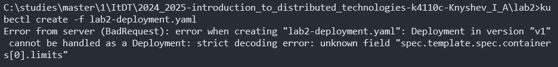

University: [ITMO](https://itmo.ru/ru/)  
Faculty: [FICT](https://fict.itmo.ru)  
Course: [Introduction to distributed technologies](https://github.com/itmo-ict-faculty/introduction-to-distributed-technologies)  
Year: 2024/2025  
Group: K4110c  
Author: [Knyshev Ivan Alekseevich](https://github.com/lowskillniy)  
Lab: [Laboratory Work №2 "Deploying a Web Service in Minikube, Accessing the Web Interface of the Service, Monitoring the Service"](https://itmo-ict-faculty.github.io/introduction-to-distributed-technologies/education/labs2023_2024/lab2/lab2)  
Date of create: 12.11.2024  
Date of finished: 14.11.2024  
### Ход работы  
1. Скачивание образа `ifilyaninitmo/itdt-contained-frontend:master` и проверка его наличия:  

2. Запуск контейнера и проверка его наличия:  

3. Написание [манифеста](lab2-deployment.yaml) для развертывания из двух подов на основе образа:  
```yaml
apiVersion: apps/v1
kind: Deployment
metadata:
  name: frontend
  labels:
    app: frontend
spec:
  replicas: 2
  selector:
    matchLabels:
      app: frontend_pod
  template:
    metadata:
      labels:
        app: frontend_pod
    spec:
      containers:
      - name: frontend-container
        image: ifilyaninitmo/itdt-contained-frontend:master
        resources: 
          limits:
            memory: "512M"
            cpu: ".5"
        ports:
        - containerPort: 3000
        env:
        - name: REACT_APP_USERNAME
          value: Knyshev Ivan
        - name: REACT_APP_COMPANY_NAME
          value: ITMO
```
4. Создание развертывания на основе манифеста:  

5. Создание сервиса типа `LoadBalancer` для доступа к развертыванию:  

6. Проброс портов к сервису:  

7. Обращение к развертыванию из браузера по адресу `http://localhost:3000/`:  

8. Просмотр активных подов `minikube`:  

9. Просмотр логов подов для текущего развертывания:  

### Схема организации контейнеров и сервисов  

### Возникшие ошибки
1. При первой попытке создать развертывание получил ошибку в терминале:  

**Решение**: поправил табуляцию в файле манифеста и выполнил команду снова – все заработало. 