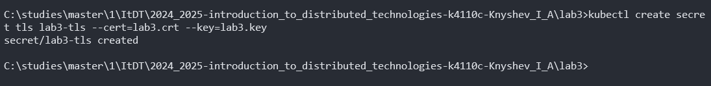

University: [ITMO](https://itmo.ru/ru/)  
Faculty: [FICT](https://fict.itmo.ru)  
Course: [Introduction to distributed technologies](https://github.com/itmo-ict-faculty/introduction-to-distributed-technologies)  
Year: 2024/2025  
Group: K4110c  
Author: [Knyshev Ivan Alekseevich](https://github.com/lowskillniy)  
Lab: [Laboratory Work №3 "Certificates and Secrets in Minikube, Secure Data Storage"](https://itmo-ict-faculty.github.io/introduction-to-distributed-technologies/education/labs2023_2024/lab3/lab3/)  
Date of create: 26.11.2024  
Date of finished: 28.11.2024  
### Теоретические сведения  
- [ConfigMap](https://kubernetes.io/docs/concepts/configuration/configmap/)
  - объект API, позволяющий хранить неконфиденциальные данные в формате `ключ: значение`.
- [ReplicaSet](https://kubernetes.io/docs/concepts/workloads/controllers/replicaset/)
  - сервис, гарантирующий работу некоторого числа идентичных подов в любой момент своей работы.
- [Ingress](https://kubernetes.io/docs/concepts/services-networking/ingress/)
  - механизм, позволяющий определять порядок доступа к сервисам внутри кластера из внешнего окружения, причем доступ может осуществляться с помощью протоколов HTTP и HTTPS.
- [TLS](https://www.cloudflare.com/en-gb/learning/ssl/transport-layer-security-tls/)
  - протокол для обеспечения приватности и безопасности обмена данными в интернете. Протокол HTTPS является реализацией протокола TLS поверх HTTP. Часто реализуется с помощью сертификатов подлинности ресурса, или же TLS-сертификатов, устанавливаемых на сервер.
### Ход работы  
1. Формирование [манифеста](lab3-configmap.yaml) для сервиса `ConfigMap`:  
```yaml
apiVersion: v1
kind: ConfigMap
metadata:
  name: frontend-configmap
data:
  react_app_user_name: "Knyshev Ivan"
  react_app_company_name: "ITMO"
```  
2. Запуск `minikube` командой `minikube start`, создание `frontend-configmap` командой `kubectl create -f lab3-configmap.yaml` и проверка результата командой `kubectl get configmaps`:  
  
3. Формирование [манифеста](lab3-replicaset.yaml) для контроллера `ReplicaSet`:  
```yaml
apiVersion: apps/v1
kind: ReplicaSet
metadata:
  name: frontend-replicaset
  labels:
    app: lab3-frontend
spec:
  replicas: 2
  selector:
    matchLabels:
      app: lab3-frontend
  template:
    metadata:
      labels:
        app: lab3-frontend
    spec:
      containers:
      - name: frontend-container
        image: ifilyaninitmo/itdt-contained-frontend:master
        ports:
        - containerPort: 3000
        env:
        - name: REACT_APP_USERNAME
          valueFrom:
            configMapKeyRef:
              name: frontend-configmap
              key: react_app_user_name
        - name: REACT_APP_COMPANY_NAME
          valueFrom:
            configMapKeyRef:
              name: frontend-configmap
              key: react_app_company_name
```  
4. Создание сервиса `frontend-replicaset` командой `kubectl create -f lab3-replicaset.yaml` и проверка результата командой `kubectl get rs`:  
  
5. Формирование [манифеста](lab3-ingress.yaml) для сервиса, необходимого для работы `Ingress`:  
```yaml
apiVersion: v1
kind: Service
metadata:
  name: frontend-service
  labels:
    app: lab3-frontend
spec:
  type: NodePort
  selector:
    app: lab3-frontend
  ports:
    - protocol: TCP
      port: 3000
      targetPort: 3000
      nodePort: 31111
```  
6. Удаление уже существующего от прошлой лабораторной работы сервиса `frontend-service` командой `kubectl delete service frontend-service`, запуск сервиса с аналогичным названием командой `kubectl create -f lab3-ingress.yaml` и проверка результата командой `kubectl get services`:  
  
7. Установка [openssl](https://slproweb.com/products/Win32OpenSSL.html). Генерация [приватного ключа](lab3.key) RSA командой `openssl genrsa -out lab3.key 2048`. Создание [запроса](lab3.csr) на подпись сертификата созданным ключом командой `openssl req -key lab3.key -new -out lab3.csr`:  
  
8. Подписывание [сертификата](lab3.crt) ключом на 30 дней командой `openssl x509 -signkey lab3.key -in lab3.csr -req -days 30 -out lab3.crt`:  
  
9. Создание `Secret` командой `kubectl create secret tls lab3-tls --cert=lab3.crt --key=lab3.key`:  
  
10. Включение аддонов `ingress` и `ingress-dns` для `minikube`:  
  
11. Формирование [манифеста](lab3-frontend-ingress.yaml) для `Ingress`:  
```yaml
apiVersion: networking.k8s.io/v1
kind: Ingress
metadata:
  name: frontend-ingress
spec:
  tls:
  - hosts:
      - lab3-frontend-knyshev.edu
    secretName: lab3-tls
  rules:
  - host: lab3-frontend-knyshev.edu
    http:
      paths:
      - path: /
        pathType: Prefix
        backend:
          service:
            name: frontend-service
            port:
              number: 3000
```
12. Добавление строчки `127.0.0.1 lab3-frontend-knyshev.edu` в конец файла `%windir%/system32/drivers/etc/hosts` и пробрасываем тоннель до экземпляра `Ingress` командой `minikube tunnel`:  
  
13. Переход по адресу `https://lab3-frontend-knyshev.edu` в браузере:  
  
14. Проверка сведений о TLS-сертификате посредством браузера:  
    
### Схема организации контейнеров и сервисов 
  
### Возникшие ошибки
В этот раз обошлось без них \:)