University: [ITMO](https://itmo.ru/ru/)  
Faculty: [FICT](https://fict.itmo.ru)  
Course: [Introduction to distributed technologies](https://github.com/itmo-ict-faculty/introduction-to-distributed-technologies)  
Year: 2024/2025  
Group: K4110c  
Author: [Knyshev Ivan Alekseevich](https://github.com/lowskillniy)  
Lab: [Laboratory Work №4 "Communication Networks in Minikube, CNI, and CoreDNS"](https://itmo-ict-faculty.github.io/introduction-to-distributed-technologies/education/labs2023_2024/lab4/lab4/)  
Date of create: 03.12.2024  
Date of finished: TBD  
### Теоретические сведения  
- [CNI](https://github.com/containernetworking/cni)  
  - спецификация и набор библиотек для конфигурирования сетевых интерфейсов Linux-контейнеров. Используется для настройки сети подов, в частности их IP-адресов. В рамках лабораторной работы используется [CNI Calico](https://docs.tigera.io/calico/latest/getting-started/kubernetes/minikube).  
- [CoreDNS](https://kubernetes.io/docs/tasks/administer-cluster/coredns/)  
  - DNS-сервер, позволяющий принимать запросы по UDP/TCP, TLS и gRPC. В рамках Kubernetes используется в виде аддона для обнаружения деталей окружения, чтобы новые экземпляры приложения могли подключаться к существующему окружению без ручного вмешательства.  
- [IPAM](https://docs.tigera.io/calico/latest/networking/ipam/get-started-ip-addresses)  
  -  сервис для управления IP-адресами, используется Kubernetes для выделения первых подам. CNI Calico предоставляет собственный IPAM-сервис – **calico-ipam**.  
- [IPPool](https://docs.tigera.io/calico/latest/reference/resources/ippool)  
  - Ресурс, направленный на определение наборов IP-адресов, которые Calico назначает подам, и правил для назначения первых.  
### Ход работы  
1. Запуск `minikube` с `Calico` в качестве CNI и двумя нодами:  
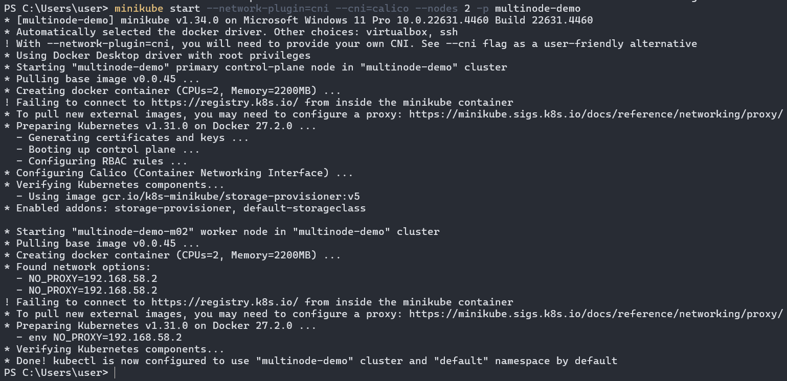  
2. Проверка успешного запуска нод и подов `Calico`:  
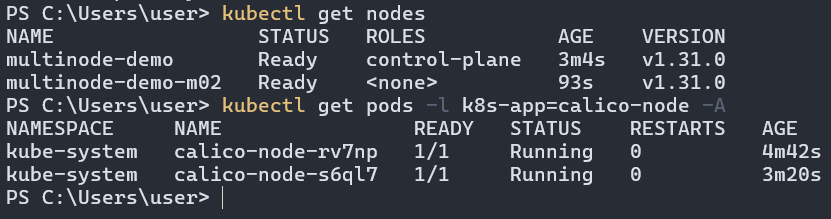  
3. Формирование [манифеста](lab4-ippool.yaml) для ресурсов `IPPool`:  
```yaml
apiVersion: projectcalico.org/v3
kind: IPPool
metadata:
   name: zone-east-ippool
spec:
   cidr: 10.10.0.0/24
   ipipMode: Always
   natOutgoing: true
   nodeSelector: zone == "east"
---
apiVersion: projectcalico.org/v3
kind: IPPool
metadata:
   name: zone-west-ippool
spec:
   cidr: 10.10.1.0/24
   ipipMode: Always
   natOutgoing: true
   nodeSelector: zone == "west"
```  
4. Назначение нодам меток в соответствие манифесту ресурсов `IPPool`:  
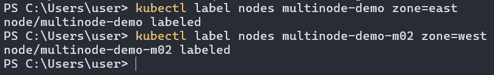  
5. Для создания ресурса `IPPool` необходимо установить `calicoctl`, что требует создание ресурса на основе [манифеста](https://github.com/projectcalico/calico/blob/master/manifests/calicoctl.yaml):  
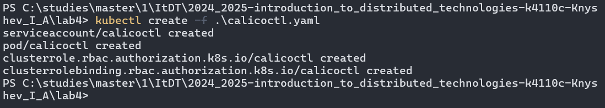  
6. Просмотр пулов IP-адресов по умолчанию:  
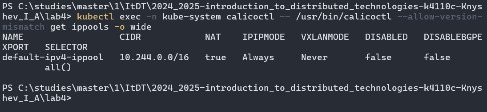  
7. Удаление пулов IP-адресов по умолчанию:  
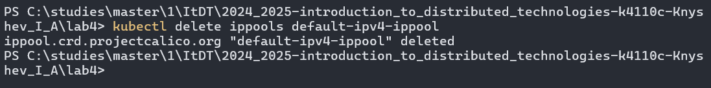  
8. Создание ресурсов `IPPool` на основе ранее созданного манифеста:  
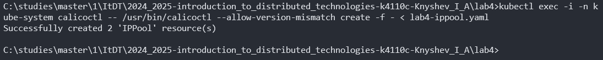  
9. Проверка успешного создания ресурсов:  
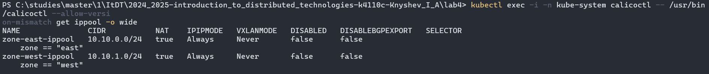  
10. Формирование [манифеста](lab4-deployment.yaml) для развертывания `lab4-deployment`:
```yaml
apiVersion: apps/v1
kind: Deployment
metadata:
  name: lab4-frontend-deployment
  labels:
    app: lab4-frontend
spec:
  replicas: 2
  selector:
    matchLabels:
      app: lab4-frontend
  template:
    metadata:
      labels:
        app: lab4-frontend
    spec:
      containers:
      - name: frontend-container
        image: ifilyaninitmo/itdt-contained-frontend:master
        resources: 
          limits:
            memory: "512M"
            cpu: ".5"
        ports:
        - containerPort: 3000
        env:
        - name: REACT_APP_USERNAME
          value: Knyshev Ivan
        - name: REACT_APP_COMPANY_NAME
          value: ITMO
```  
11. Формирование [манифеста](lab4-service.yaml) для сервиса `lab4-service`:  
```yaml
apiVersion: v1
kind: Service
metadata:
  name: lab4-service
spec:
  selector:
    app: lab4-frontend
  ports:
    - port: 3000
      targetPort: 3000
  type: LoadBalancer
```
12. Создание развертывания и сервиса с последюущей проверкой:
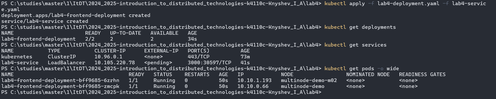  
13. Проброс порта командой `kubectl port-forward service/lab4-service 8200:3000` и подключение к сервису через браузер по адресу `http://localhost:8200/`:  
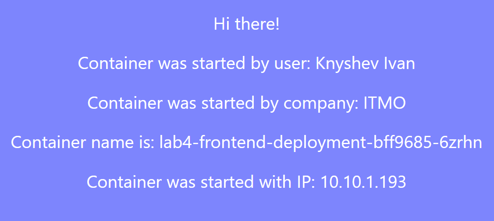  
14. Проверка доступности контейнера `lab4-frontend-deployment-bff9685-zmcpk` из контейнера `lab4-frontend-deployment-bff9685-6zrhn`:  
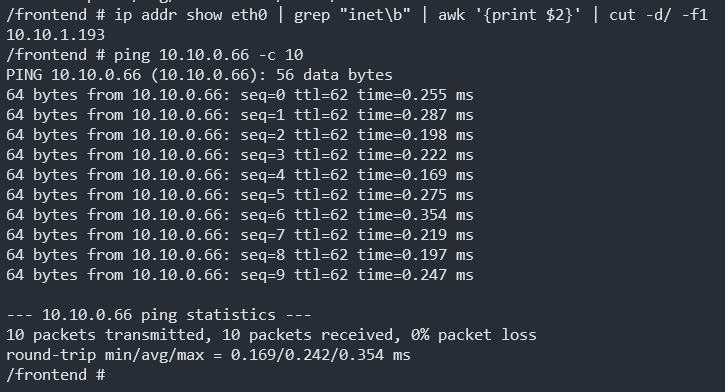  
15. Проверка доступности контейнера `lab4-frontend-deployment-bff9685-6zrhn` из контейнера `lab4-frontend-deployment-bff9685-zmcpk`:  
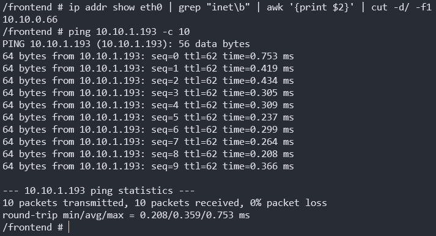  
### Схема организации контейнеров и сервисов  
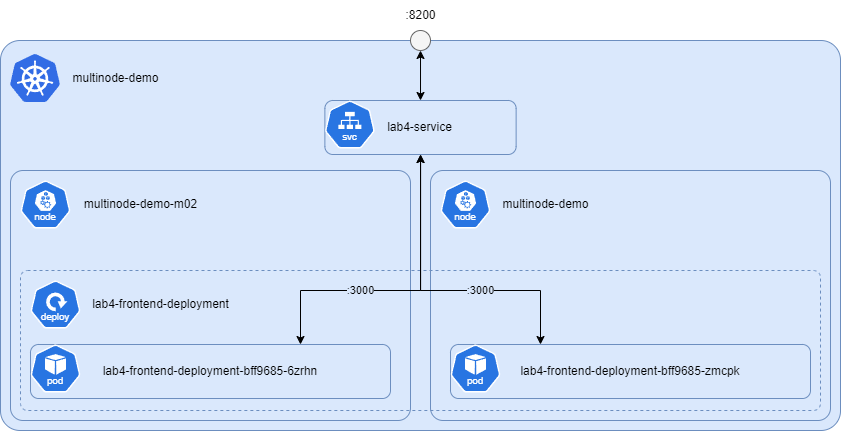  